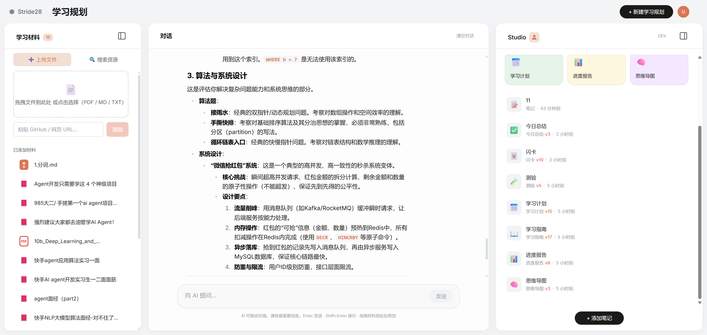
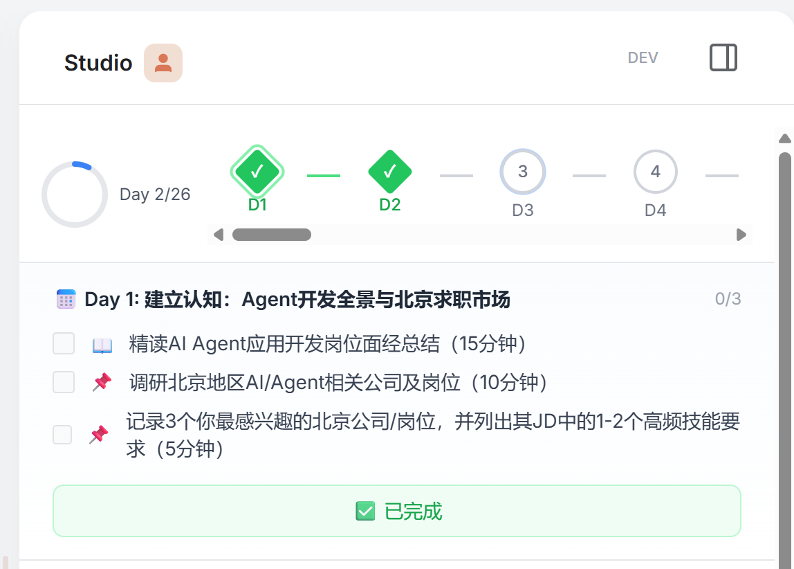
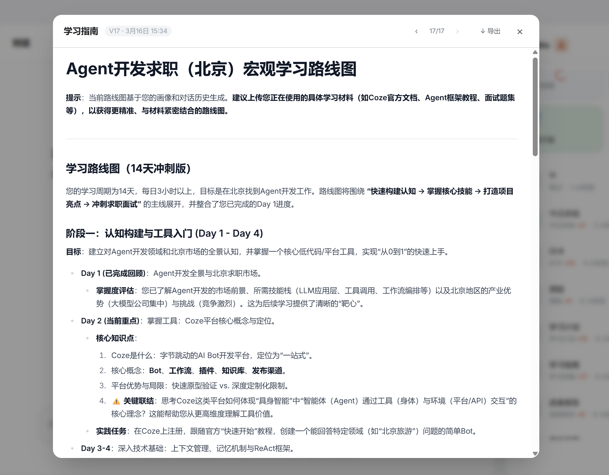
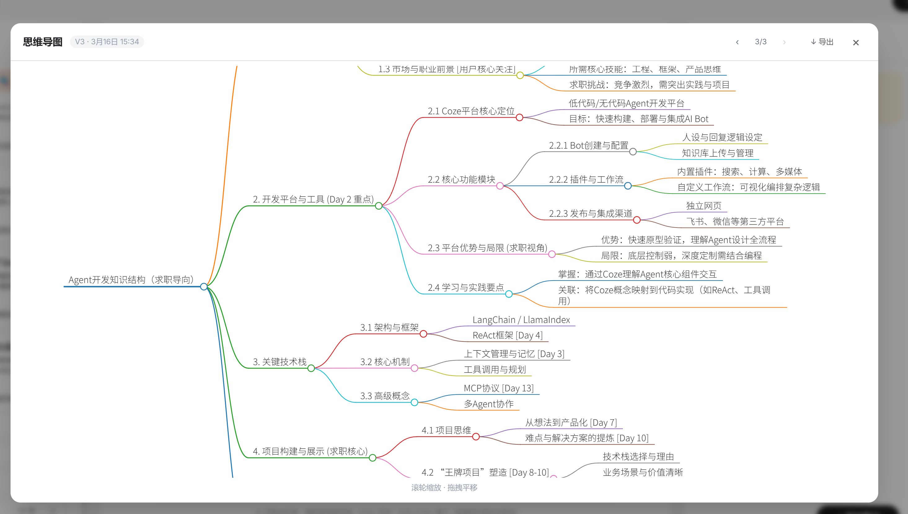

<p align="center">
  
</p>

<p align="center">
  AI-powered research & planning assistant. Turn scattered information into actionable plans.
</p>

<p align="center">
  <a href="https://github.com/BrunonXU/Stride28"></a>
  <a href="https://github.com/BrunonXU/Stride28/blob/main/LICENSE"></a>
  
  
  <a href="#contributing"></a>
</p>

<p align="center">
  <a href="README.md">中文</a> | <strong>English</strong>
</p>

<p align="center">
  <a href="#the-problem">Why</a> •
  <a href="#core-features">Features</a> •
  <a href="#quick-start">Quick Start</a> •
  <a href="#architecture">Architecture</a> •
  <a href="#roadmap">Roadmap</a> •
  <a href="#contributing">Contributing</a>
</p>

<p align="center">
  
</p>

---

## The Problem

Learning something new typically involves: find resources → filter → organize → make a plan → execute → review. Most AI tools only help with one step.

Stride28 chains the entire workflow into a stateful, context-accumulating pipeline:

```
Multi-source search → Quality filtering → Material accumulation → Plan generation
→ Conversational tutoring → Progress tracking → Iterative adjustment
```

Your materials, chat history, learner profile, and completion progress — all become the Agent's context. Every output builds on this growing context instead of starting from scratch.

---

## Core Features

### 🔍 Multi-Source Search Aggregation

Four-tier search architecture (Community / Developer / Academic / Broad Web) with concurrent search across 6 platforms. Different tiers follow different data paths: UGC platforms go through a two-stage quality funnel (engagement metrics → LLM quality assessment), arXiv papers bypass the funnel for direct display, and Tavily web results skip browser extraction for direct LLM evaluation. Supports Context-Aware Query Rewrite — the same query generates platform-specific keywords.

Platforms: Xiaohongshu · Zhihu · Bilibili · GitHub · arXiv · Tavily


<p align="center">
  
</p>

### 📚 Context Accumulation

One-click to save search results as materials. Direct PDF / Markdown upload. All materials feed into a unified context pool that powers planning, chat, and content generation.

### 💬 Material-Aware Chat

Two modes: drag materials into the chat input for precise Q&A; Studio tools use two-stage retrieval (embedding recall → Cross-Encoder reranker) with layered injection. Chat deliberately avoids global RAG — only explicitly attached materials are used, preventing irrelevant content from polluting answers.

<p align="center">
  
</p>

### 🎯 7 Structured Studio Tools

Study Guide · Learning Plan · Flashcards · Quiz · Mind Map · Progress Report · Day Summary

All tools are context-aware — dynamically generated based on your materials, chat history, learner profile, and progress. Prompts are assembled via Python-side conditional branching, so the LLM receives clear, unambiguous instructions.

<p align="center">
  
</p>

### 🧠 Cross-Session Memory

Dual-layer memory: Working Memory retains recent chat verbatim; Episodic Memory compresses history into structured summaries. Clearing chat ≠ forgetting — your past confusion points and learning preferences continue to influence future outputs.

<p align="center">
  
  
</p>

---

## Quick Start

### Prerequisites

- Python 3.10+, Node.js 18+
- LLM API Key (recommend [DeepSeek](https://platform.deepseek.com/))
- [DashScope](https://dashscope.console.aliyun.com/) API Key (required for embedding)

### Docker (Recommended)

```bash
git clone https://github.com/BrunonXU/Stride28.git && cd Stride28
cp .env.example .env
# Edit .env, fill in API keys

docker compose up -d
# Frontend: http://localhost  Backend: http://localhost:8000
```

### Local Development

```bash
git clone https://github.com/BrunonXU/Stride28.git && cd Stride28

# Backend
python -m venv venv && source venv/bin/activate  # Windows: .\venv\Scripts\activate
pip install -r requirements.txt
playwright install chromium

# Frontend
cd frontend && npm install && cd ..

# Config
cp .env.example .env  # Edit and fill in API keys

# Start (two terminals)
uvicorn backend.main:app --port 8000
cd frontend && npm run dev
# Open http://localhost:3000
```

### Configuration

| Variable | Required | Description |
|----------|:--------:|-------------|
| `DEEPSEEK_API_KEY` | ✅ | LLM (at least one provider required) |
| `DASHSCOPE_API_KEY` | ✅ | Embedding (text-embedding-v2, cannot be switched) |
| `RERANKER_ENABLED` | — | Enable Cross-Encoder reranker; downloads ~2.3GB model on first run |
| `GITHUB_TOKEN` | — | Increases GitHub search rate limit (10/min without token) |
| `LANGSMITH_API_KEY` | — | LangSmith full-chain tracing |
| `DEFAULT_PROVIDER` | — | Default `deepseek`; options: `openai` / `zhipu` / `tongyi` |

See [`.env.example`](.env.example) for full configuration.

> On first launch, a demo learning plan is injected (with search history, materials, and Studio content) so you can explore the full workflow immediately.

---

## Architecture

```
┌─────────────────────────────────────────────────────────┐
│  React + TypeScript + Zustand + TailwindCSS             │
│  Three-panel layout: Materials │ Chat │ Studio          │
└────────────────────────┬────────────────────────────────┘
                         │ REST API + SSE
┌────────────────────────┴────────────────────────────────┐
│  FastAPI                                                 │
│  plans / chat / studio / search / resource / upload /    │
│  notes / dev / provider                                  │
├──────────────────────────────────────────────────────────┤
│  agents/       TutorAgent + Episodic Memory              │
│  providers/    OpenAI-compatible abstraction (4 vendors)  │
│  specialists/  Search module (4-tier architecture, 6 platforms)│
│  rag/          ChromaDB + Cross-Encoder Reranker         │
├──────────────────────────────────────────────────────────┤
│  SQLite (WAL) + ChromaDB (text-embedding-v2)             │
│  LangSmith full-chain tracing                            │
└──────────────────────────────────────────────────────────┘
```

---

## Roadmap
**Done:** NotebookLM-style three-panel UI · Four-tier search architecture (6 platforms + tier-based routing + Context-Aware Query Rewrite) · Two-stage quality funnel · Material-aware chat · SQLite persistence · Episodic Memory · Dynamic prompt assembly · Multi-provider support · LangSmith tracing · RAG layered injection · Cross-Encoder Reranker · Coverage-first context budget · LangGraph Chat Orchestrator · Lightweight auto-evaluation framework (Search / RAG / Latency)

**In Progress / Planned:**
- [ ] Studio Prompt A/B evaluation
- [ ] Multi-modal material understanding (PDF images + VL models)
- [ ] Demo video & onboarding flow

---

## Contributing

PRs, issues, and feature requests are welcome.

Development notes:
- Backend changes (Python / `.env`) require server restart; frontend changes hot-reload via Vite HMR
- Database fields use `snake_case`, API returns `camelCase` (auto-converted)
- Embedding model is fixed (`text-embedding-v2`) — switching breaks vector compatibility

---

## License

[MIT](LICENSE)

---

<p align="center">
  If Stride28 helps you learn something new, consider giving it a ⭐
</p>
